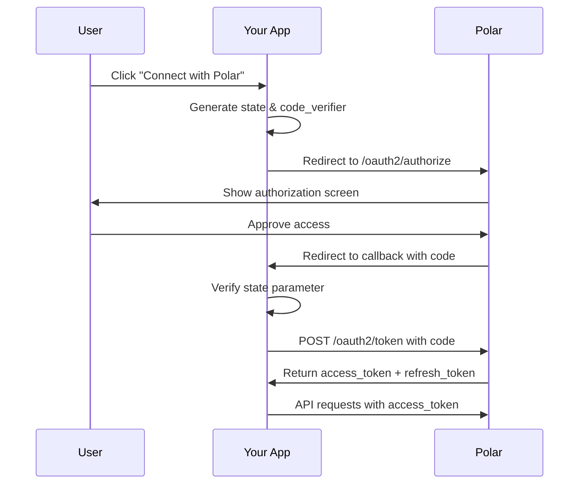

This guide walks through implementing the OAuth 2.0 authorization code flow with Polar.

## Flow Overview



## Step 1: Authorization Request

Redirect users to Polar's authorization endpoint to request access.

### Build Authorization URL

```python
import secrets
from urllib.parse import urlencode

# Generate random state for CSRF protection
state = secrets.token_urlsafe(32)
session["oauth_state"] = state

# Build authorization URL
params = {
    "client_id": "polar_ci_...",
    "response_type": "code",
    "redirect_uri": "https://example.com/auth/callback",
    "scope": "openid profile email products:read orders:read",
    "state": state,
    "sub_type": "organization",  # or "user"
}

authorize_url = f"https://polar.sh/oauth2/authorize?{urlencode(params)}"

# Redirect user
return redirect(authorize_url)
```

```typescript
import crypto from "crypto";

// Generate random state
const state = crypto.randomBytes(32).toString("hex");
req.session.oauthState = state;

// Build authorization URL
const params = new URLSearchParams({
  client_id: "polar_ci_...",
  response_type: "code",
  redirect_uri: "https://example.com/auth/callback",
  scope: "openid profile email products:read orders:read",
  state,
  sub_type: "organization",
});

const authorizeUrl = `https://polar.sh/oauth2/authorize?${params}`;

// Redirect user
res.redirect(authorizeUrl);
```

### Authorization Parameters

**Required:**

- `client_id` - Your OAuth client ID
- `response_type` - Must be `"code"`
- `redirect_uri` - Must match a registered redirect URI exactly
- `scope` - Space-separated list of requested scopes
- `state` - Random string to prevent CSRF (you must verify this in callback)

**Optional:**

- `sub_type` - `"user"` or `"organization"` (defaults to client's `default_sub_type`)
- `sub` - Specific organization ID (only for `sub_type: organization`)
- `prompt` - `"none"` (skip consent if already granted), `"consent"` (always show consent)
- `code_challenge` - PKCE code challenge (recommended for public clients)
- `code_challenge_method` - Must be `"S256"` if using PKCE

### PKCE (Recommended for Public Clients)

For mobile apps and SPAs, use PKCE to protect the authorization code:

```python
import hashlib
import base64
import secrets

# Generate code verifier
code_verifier = secrets.token_urlsafe(64)
session["code_verifier"] = code_verifier

# Generate code challenge
code_challenge = base64.urlsafe_b64encode(
    hashlib.sha256(code_verifier.encode()).digest()
).decode().rstrip("=")

# Include in authorization URL
params = {
    # ... other params
    "code_challenge": code_challenge,
    "code_challenge_method": "S256",
}
```

## Step 2: User Authorization

Polar shows the user an authorization screen with:

- Your app's name, logo, and description
- Requested scopes in human-readable format
- Organization selector (if `sub_type: organization`)
- Allow/Deny buttons

### User Flow

**For User Subject:**

1. User sees requested permissions
2. User clicks "Allow" or "Deny"
3. User is redirected to your `redirect_uri`

**For Organization Subject:**

1. User sees list of their organizations
2. User selects an organization to connect
3. User sees requested permissions
4. User clicks "Allow" or "Deny"
5. User is redirected to your `redirect_uri`

### Consent Bypass

If the user has already granted your app access to the requested scopes:

- With `prompt=none` - Authorization succeeds immediately without showing the consent screen
- Without `prompt` - User is redirected immediately (default behavior for already-consented apps)

## Step 3: Handle Callback

Polar redirects users back to your `redirect_uri` with a `code` parameter.

### Success Response

```
https://example.com/auth/callback?
  code=polar_ac_...
  &state=abc123...
```

### Error Response

```
https://example.com/auth/callback?
  error=access_denied
  &error_description=The+user+denied+the+request
  &state=abc123...
```

### Callback Handler

```python
from flask import request, session, redirect

@app.route("/auth/callback")
def oauth_callback():
    # Verify state parameter (CSRF protection)
    if request.args.get("state") != session.get("oauth_state"):
        return "Invalid state parameter", 400
    
    # Check for errors
    error = request.args.get("error")
    if error:
        error_description = request.args.get("error_description", "")
        return f"Authorization failed: {error} - {error_description}", 400
    
    # Get authorization code
    code = request.args.get("code")
    if not code:
        return "Missing authorization code", 400
    
    # Exchange code for tokens (next step)
    tokens = exchange_code_for_tokens(code)
    
    # Store tokens securely
    session["access_token"] = tokens["access_token"]
    session["refresh_token"] = tokens["refresh_token"]
    
    return redirect("/dashboard")
```

```typescript
app.get("/auth/callback", async (req, res) => {
  // Verify state parameter
  if (req.query.state !== req.session.oauthState) {
    return res.status(400).send("Invalid state parameter");
  }

  // Check for errors
  if (req.query.error) {
    return res
      .status(400)
      .send(`Authorization failed: ${req.query.error}`);
  }

  // Get authorization code
  const code = req.query.code as string;
  if (!code) {
    return res.status(400).send("Missing authorization code");
  }

  // Exchange code for tokens
  const tokens = await exchangeCodeForTokens(code);

  // Store tokens securely
  req.session.accessToken = tokens.access_token;
  req.session.refreshToken = tokens.refresh_token;

  res.redirect("/dashboard");
});
```

<Warning>
  **Always verify the `state` parameter** to prevent CSRF attacks. If the state doesn't match what you sent, reject the request.
</Warning>

## Step 4: Exchange Code for Tokens

Exchange the authorization code for access and refresh tokens.

### Token Request

```python
import httpx

def exchange_code_for_tokens(code: str) -> dict:
    response = httpx.post(
        "https://api.polar.sh/v1/oauth2/token",
        data={
            "grant_type": "authorization_code",
            "code": code,
            "redirect_uri": "https://example.com/auth/callback",
            "client_id": "polar_ci_...",
            "client_secret": "polar_cs_...",
            # Include code_verifier if using PKCE
            # "code_verifier": session["code_verifier"],
        },
        headers={"Content-Type": "application/x-www-form-urlencoded"},
    )
    response.raise_for_status()
    return response.json()
```

```typescript
async function exchangeCodeForTokens(code: string) {
  const response = await fetch("https://api.polar.sh/v1/oauth2/token", {
    method: "POST",
    headers: {
      "Content-Type": "application/x-www-form-urlencoded",
    },
    body: new URLSearchParams({
      grant_type: "authorization_code",
      code,
      redirect_uri: "https://example.com/auth/callback",
      client_id: process.env.POLAR_CLIENT_ID!,
      client_secret: process.env.POLAR_CLIENT_SECRET!,
    }),
  });

  if (!response.ok) {
    throw new Error(`Token exchange failed: ${response.statusText}`);
  }

  return await response.json();
}
```

### Token Response

```json
{
  "access_token": "polar_at_o_...",
  "token_type": "Bearer",
  "expires_in": 3600,
  "refresh_token": "polar_rt_o_...",
  "scope": "openid profile email products:read orders:read",
  "id_token": "eyJhbGciOiJSUzI1NiIsInR5cCI6IkpXVCJ9..."
}
```

**Response Fields:**

- `access_token` - Bearer token for API requests (valid 1 hour)
- `token_type` - Always `"Bearer"`
- `expires_in` - Seconds until access token expires (3600 = 1 hour)
- `refresh_token` - Token to get new access tokens (valid until revoked)
- `scope` - Granted scopes (may differ from requested)
- `id_token` - JWT with user/organization info (OpenID Connect)

<Note>
  The authorization code expires after **10 minutes** and can only be used **once**. Store the tokens immediately.
</Note>

## Step 5: Use Access Token

Use the access token to make API requests.

### API Request

```python
import polar_sdk

client = polar_sdk.Polar(
    access_token=session["access_token"]
)

# List products
products = client.products.list()

# Create a checkout
checkout = client.checkouts.create(
    product_price_id="price_...",
    customer_email="customer@example.com",
)
```

```typescript
import { Polar } from "@polar-sh/sdk";

const polar = new Polar({
  accessToken: req.session.accessToken,
});

// List products
const products = await polar.products.list();

// Create a checkout
const checkout = await polar.checkouts.create({
  productPriceId: "price_...",
  customerEmail: "customer@example.com",
});
```

### Raw HTTP Request

```python
import httpx

response = httpx.get(
    "https://api.polar.sh/v1/products",
    headers={
        "Authorization": f"Bearer {access_token}",
    },
)
products = response.json()
```

## Step 6: Refresh Access Tokens

Access tokens expire after 1 hour. Use the refresh token to get a new access token.

### Refresh Token Request

```python
def refresh_access_token(refresh_token: str) -> dict:
    response = httpx.post(
        "https://api.polar.sh/v1/oauth2/token",
        data={
            "grant_type": "refresh_token",
            "refresh_token": refresh_token,
            "client_id": "polar_ci_...",
            "client_secret": "polar_cs_...",
        },
        headers={"Content-Type": "application/x-www-form-urlencoded"},
    )
    response.raise_for_status()
    return response.json()

# Use in your API calls
try:
    products = client.products.list()
except UnauthorizedError:
    # Token expired, refresh it
    new_tokens = refresh_access_token(session["refresh_token"])
    session["access_token"] = new_tokens["access_token"]
    # Retry with new token
    client = polar_sdk.Polar(access_token=new_tokens["access_token"])
    products = client.products.list()
```

### Automatic Token Refresh

```python
from functools import wraps

def with_token_refresh(func):
    @wraps(func)
    def wrapper(*args, **kwargs):
        try:
            return func(*args, **kwargs)
        except UnauthorizedError:
            # Refresh token
            new_tokens = refresh_access_token(session["refresh_token"])
            session["access_token"] = new_tokens["access_token"]
            if "refresh_token" in new_tokens:
                session["refresh_token"] = new_tokens["refresh_token"]
            # Retry
            return func(*args, **kwargs)
    return wrapper

@with_token_refresh
def get_products():
    client = polar_sdk.Polar(access_token=session["access_token"])
    return client.products.list()
```

<Warning>
  Refresh tokens can also expire or be revoked. If refresh fails, redirect the user to re-authorize.
</Warning>

## Getting User Information

Use the `/oauth2/userinfo` endpoint to get user or organization details.

### UserInfo Request

```python
response = httpx.get(
    "https://api.polar.sh/v1/oauth2/userinfo",
    headers={"Authorization": f"Bearer {access_token}"},
)
userinfo = response.json()
```

### User Subject Response

```json
{
  "sub": "user_123",
  "name": "John Doe",
  "email": "john@example.com",
  "email_verified": true
}
```

### Organization Subject Response

```json
{
  "sub": "org_456",
  "name": "Acme Corporation"
}
```

## Revoking Tokens

Revoke access or refresh tokens when users disconnect your app.

```python
httpx.post(
    "https://api.polar.sh/v1/oauth2/revoke",
    data={
        "token": access_token,
        "token_type_hint": "access_token",
        "client_id": "polar_ci_...",
        "client_secret": "polar_cs_...",
    },
)
```

<Note>
  Revoking a refresh token also revokes all access tokens issued from it.
</Note>

## Error Handling

### Authorization Errors

- `access_denied` - User denied authorization
- `invalid_request` - Missing or invalid parameters
- `invalid_scope` - Requested scopes are invalid
- `server_error` - Server error, retry later

### Token Errors

- `invalid_grant` - Authorization code expired or already used
- `invalid_client` - Invalid client credentials
- `unauthorized_client` - Client not authorized for this grant type

### API Errors

- `401 Unauthorized` - Access token expired or invalid (refresh token)
- `403 Forbidden` - Token doesn't have required scopes
- `429 Too Many Requests` - Rate limit exceeded (check `Retry-After` header)

## Complete Example

Here's a complete Flask app with OAuth:

```python
from flask import Flask, redirect, request, session, url_for
import httpx
import secrets
import polar_sdk

app = Flask(__name__)
app.secret_key = "your-secret-key"

CLIENT_ID = "polar_ci_..."
CLIENT_SECRET = "polar_cs_..."
REDIRECT_URI = "http://localhost:5000/auth/callback"

@app.route("/")
def index():
    if "access_token" in session:
        return redirect(url_for("dashboard"))
    return '<a href="/auth/login">Connect with Polar</a>'

@app.route("/auth/login")
def login():
    state = secrets.token_urlsafe(32)
    session["oauth_state"] = state
    
    params = {
        "client_id": CLIENT_ID,
        "response_type": "code",
        "redirect_uri": REDIRECT_URI,
        "scope": "openid profile email products:read",
        "state": state,
        "sub_type": "organization",
    }
    
    from urllib.parse import urlencode
    return redirect(f"https://polar.sh/oauth2/authorize?{urlencode(params)}")

@app.route("/auth/callback")
def callback():
    # Verify state
    if request.args.get("state") != session.get("oauth_state"):
        return "Invalid state", 400
    
    # Check for errors
    if request.args.get("error"):
        return f"Error: {request.args.get('error')}", 400
    
    # Exchange code for tokens
    code = request.args.get("code")
    response = httpx.post(
        "https://api.polar.sh/v1/oauth2/token",
        data={
            "grant_type": "authorization_code",
            "code": code,
            "redirect_uri": REDIRECT_URI,
            "client_id": CLIENT_ID,
            "client_secret": CLIENT_SECRET,
        },
    )
    tokens = response.json()
    
    # Store tokens
    session["access_token"] = tokens["access_token"]
    session["refresh_token"] = tokens["refresh_token"]
    
    return redirect(url_for("dashboard"))

@app.route("/dashboard")
def dashboard():
    if "access_token" not in session:
        return redirect(url_for("login"))
    
    client = polar_sdk.Polar(access_token=session["access_token"])
    products = client.products.list()
    
    return f"<h1>Products</h1><pre>{products}</pre>"

@app.route("/auth/logout")
def logout():
    # Revoke token
    if "access_token" in session:
        httpx.post(
            "https://api.polar.sh/v1/oauth2/revoke",
            data={
                "token": session["access_token"],
                "client_id": CLIENT_ID,
                "client_secret": CLIENT_SECRET,
            },
        )
    
    session.clear()
    return redirect(url_for("index"))

if __name__ == "__main__":
    app.run(debug=True)
```

## Next Steps

<CardGroup cols={2}>
  <Card title="API Reference" icon="code" href="/api-reference">
    Explore available API endpoints
  </Card>
  <Card title="OAuth App Setup" icon="gear" href="/integrate/oauth2/setup">
    Learn about client configuration
  </Card>
</CardGroup>