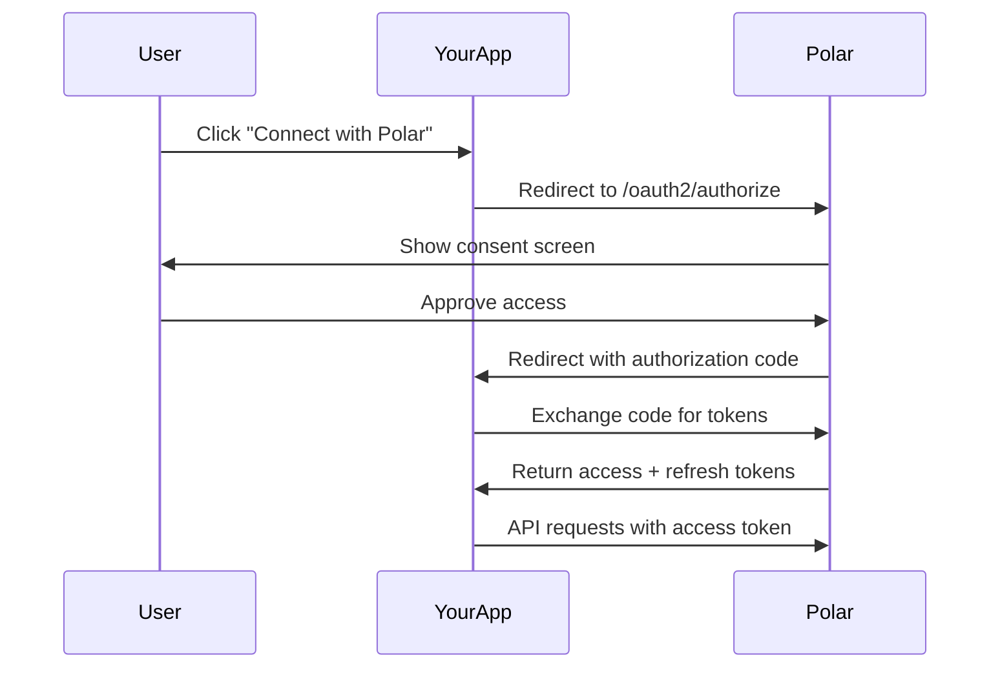

Polar implements OAuth 2.0 with OpenID Connect, allowing your application to authenticate users and access their Polar data securely.

## Use Cases

### User Authentication

Allow users to sign in to your application with their Polar account:

- Seamless single sign-on (SSO)
- Access to user profile, email, and organizations
- No need to manage passwords

### API Access

Access Polar's API on behalf of users or organizations:

- Read and manage products
- Create checkout sessions
- Access orders and subscriptions
- Manage customers and webhooks

### Multi-Organization Apps

Build apps that work across multiple Polar organizations:

- Users grant access to specific organizations
- Separate tokens per organization
- Fine-grained permission scopes

## OAuth 2.0 Flow

Polar supports the **Authorization Code Flow**, the most secure OAuth flow for web applications:



### Key Concepts

**OAuth Client:** Your application registered in Polar. Each client has:
- `client_id`: Public identifier
- `client_secret`: Secret key for token exchange (keep secure!)
- Redirect URIs: Allowed URLs for receiving authorization codes

**Authorization Code:** Short-lived code exchanged for tokens. Valid for 10 minutes.

**Access Token:** Bearer token for API requests. Valid for 1 hour.

**Refresh Token:** Long-lived token to obtain new access tokens. Valid until revoked.

**Scopes:** Permissions your app requests. Users see these in the consent screen.

**Subject Type:** Whether your app accesses data as a `user` or `organization`.

## Subject Types

Polar supports two subject types:

### User Subject (`sub_type: user`)

Access APIs as the authenticated user:

- Read user profile and email
- List user's organizations
- Perform actions as the user

**Example use case:** A dashboard app that shows a user's organizations and personal profile.

### Organization Subject (`sub_type: organization`)

Access APIs as a specific organization:

- Read and manage organization resources (products, customers, orders)
- Create checkouts and webhooks
- Access organization-specific data

**Example use case:** An integration that manages products and orders for a specific organization.

<Note>
  Most integrations should use **organization** subject type to access organization data. Use **user** subject type only for personal user data.
</Note>

## Available Scopes

Scopes define what your application can access. Users see these in the consent screen.

### Identity Scopes

- `openid` - Required for OpenID Connect
- `profile` - Read user profile (name, avatar)
- `email` - Read user email address

### Resource Scopes

Each resource has separate read and write scopes:

- `products:read` / `products:write` - Products and pricing
- `orders:read` / `orders:write` - Orders and transactions
- `subscriptions:read` / `subscriptions:write` - Subscriptions
- `customers:read` / `customers:write` - Customer records
- `checkouts:read` / `checkouts:write` - Checkout sessions
- `benefits:read` / `benefits:write` - Benefits and grants
- `webhooks:read` / `webhooks:write` - Webhook endpoints
- `files:read` / `files:write` - File uploads
- `metrics:read` - Analytics and metrics

<Tip>
  Request only the scopes you need. Users are more likely to approve requests with minimal permissions.
</Tip>

## Token Prefixes

Polar uses prefixed tokens for easy identification and security scanning:

```
Client ID:              polar_ci_...
Client Secret:          polar_cs_...
Authorization Code:     polar_ac_...
Access Token (User):    polar_at_u_...
Access Token (Org):     polar_at_o_...
Refresh Token (User):   polar_rt_u_...
Refresh Token (Org):    polar_rt_o_...
```

<Warning>
  Never commit tokens to version control or expose them in client-side code. Always store secrets in environment variables.
</Warning>

## Security Best Practices

### Use HTTPS

All redirect URIs must use HTTPS in production. HTTP is only allowed for `localhost` during development.

### Validate State Parameter

Always use the `state` parameter to prevent CSRF attacks:

```python
import secrets

# Generate state before redirecting to authorize
state = secrets.token_urlsafe(32)
session["oauth_state"] = state

# Validate state in callback
if request.args.get("state") != session.get("oauth_state"):
    raise Exception("Invalid state parameter")
```

### Use PKCE

For public clients (mobile, SPA), use PKCE (Proof Key for Code Exchange):

```python
import hashlib
import base64
import secrets

# Generate code verifier
code_verifier = secrets.token_urlsafe(64)

# Generate code challenge
code_challenge = base64.urlsafe_b64encode(
    hashlib.sha256(code_verifier.encode()).digest()
).decode().rstrip("=")

# Include in authorization URL
authorize_url = (
    "https://polar.sh/oauth2/authorize?"
    f"client_id={client_id}&"
    f"code_challenge={code_challenge}&"
    f"code_challenge_method=S256"
)

# Send code_verifier in token request
```

### Secure Token Storage

- Store tokens server-side when possible
- Encrypt tokens at rest
- Use secure session cookies for web apps
- Never expose tokens in URLs or logs

### Handle Token Expiration

Access tokens expire after 1 hour. Use refresh tokens to obtain new access tokens:

```python
try:
    response = polar.products.list()
except UnauthorizedError:
    # Token expired, refresh it
    new_tokens = refresh_access_token(refresh_token)
    # Retry request with new token
```

## Rate Limits

Polar's API has rate limits to ensure fair usage:

- **User tokens:** 1000 requests per hour
- **Organization tokens:** 5000 requests per hour

When rate limited, you'll receive a `429 Too Many Requests` response with a `Retry-After` header.

## Testing & Development

### Localhost Redirect URIs

You can use `http://localhost` and `http://127.0.0.1` for local development:

```
http://localhost:3000/callback
http://127.0.0.1:8000/auth/callback
```

### Multiple Redirect URIs

Register multiple redirect URIs for development, staging, and production:

```python
client = polar.oauth2.create_client(
    client_name="My App",
    redirect_uris=[
        "http://localhost:3000/callback",
        "https://staging.example.com/callback",
        "https://example.com/callback",
    ]
)
```

### Test Users

Create test organizations in Polar's dashboard to test your OAuth integration without affecting production data.

## Well-Known Endpoints

Polar exposes OAuth 2.0 discovery endpoints:

**Authorization Server Metadata:**
```
https://polar.sh/.well-known/oauth-authorization-server
```

**OpenID Configuration:**
```
https://polar.sh/.well-known/openid-configuration
```

**JSON Web Keys (JWKS):**
```
https://polar.sh/.well-known/jwks.json
```

These endpoints provide metadata about Polar's OAuth implementation, including supported scopes, grant types, and signing keys.

## Next Steps

<CardGroup cols={2}>
  <Card title="Creating an OAuth App" icon="plus" href="/integrate/oauth2/setup">
    Register your application and get credentials
  </Card>
  <Card title="OAuth Connection Flow" icon="arrows-rotate" href="/integrate/oauth2/connect">
    Implement the authorization code flow
  </Card>
</CardGroup>